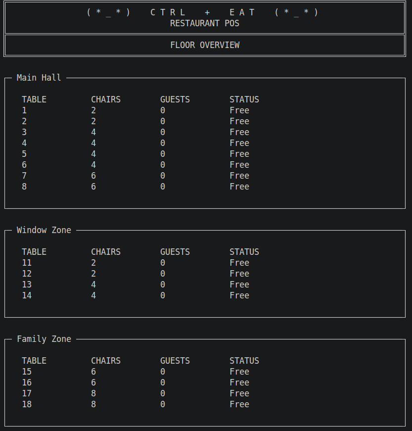
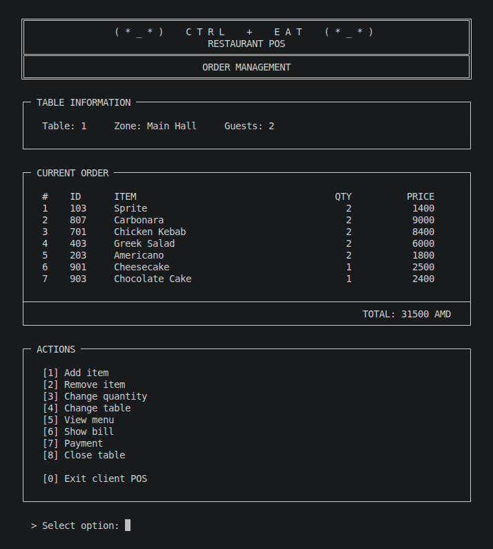
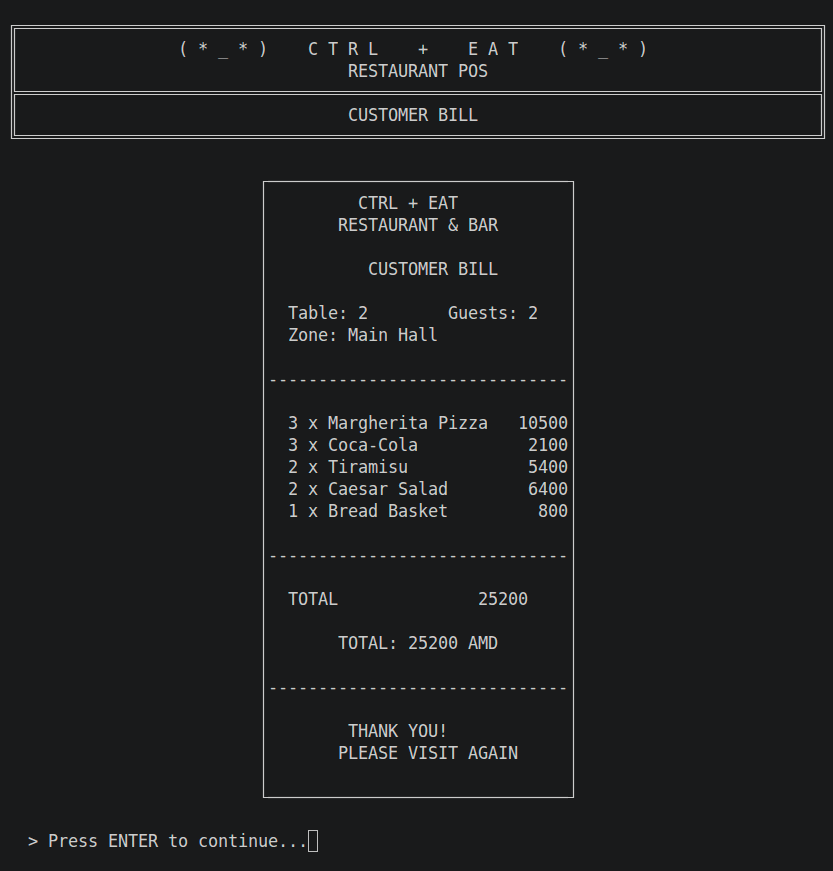
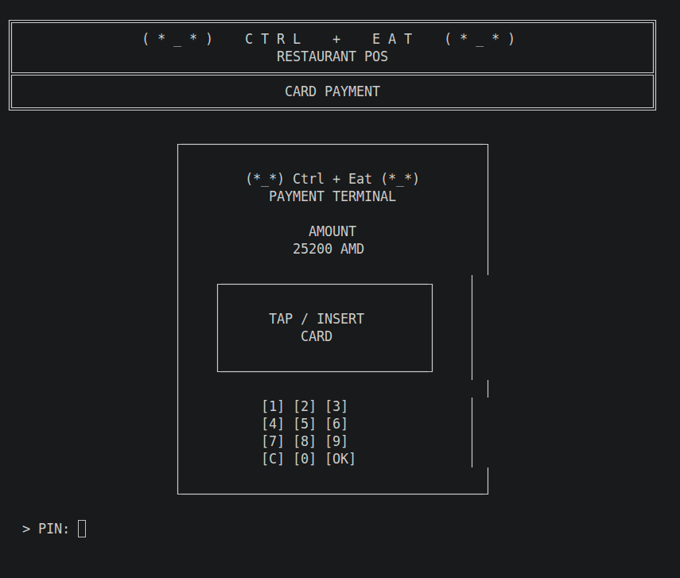

# CTRL + EAT — Restaurant POS System

A console-based Restaurant Point of Sale (POS) system developed in **C++17**.

The project models the core workflow of a real restaurant: restaurant zones and tables, menu management, customer orders, billing, and payment processing through an interactive terminal interface.

## Features

- Restaurant zones and tables
- Globally unique table numbers
- Table opening with guest validation
- Table status management
- Categorized restaurant menu
- Menu loading from a text file
- Active order associated with each occupied table
- Add and remove order items
- Change item quantities
- Automatic total calculation
- Restaurant-style customer bill
- Cash payment simulation
- Card terminal payment simulation
- Payment confirmation sound on Linux
- Table closing only after successful payment
- Unicode-based POS terminal interface

## Screenshots

### Floor Overview



### Order Management

Manage an active table order, add or remove items, change quantities, view the current total, and continue to billing or payment.



### Customer Bill



### Card Payment Terminal



## Architecture

The restaurant and menu are modeled using separate object hierarchies:

```text
Restaurant
└── Zone
    └── Table
        └── optional<Order>
            └── OrderItem

Menu
└── MenuCategory
    └── MenuItem
```

### Main Classes

- `Restaurant` — owns and manages restaurant zones
- `Zone` — contains restaurant tables
- `Table` — represents table state and its active order
- `Menu` — manages menu categories
- `MenuCategory` — contains menu items
- `MenuItem` — represents an item available for ordering
- `Order` — manages the active customer order
- `OrderItem` — stores an ordered item's price snapshot and quantity

## Technologies and Concepts

- C++17
- Object-Oriented Programming
- Encapsulation
- Composition
- Const correctness
- Pointers and references
- `std::vector`
- `std::optional`
- File I/O
- STL
- Object lifetime management
- Linux terminal
- Unicode console UI

## Build

Compile with GCC:

```bash
g++ -std=c++17 -Wall -Wextra -Wpedantic \
main.cpp Table.cpp Zone.cpp Restaurant.cpp \
MenuItem.cpp MenuCategory.cpp Menu.cpp \
OrderItem.cpp Order.cpp Interface.cpp \
-o restaurant
```

## Run

```bash
./restaurant
```

## Menu Data

The restaurant menu is loaded from `menu.txt`.

Example:

```text
[Soft Drinks]
101,Coca-Cola,700
102,Fanta,700
103,Sprite,700

[Main Courses]
601,Chicken Breast,4800
602,Chicken Alfredo,5200
```

## Order Lifecycle

```text
Free Table
    ↓
Open Table
    ↓
Add Guests
    ↓
Create Order
    ↓
Add / Remove / Change Items
    ↓
Generate Bill
    ↓
Cash or Card Payment
    ↓
Close Table
    ↓
Free Table
```

## Current Status

The core restaurant POS workflow and client interface are implemented.

### Implemented

- Restaurant / Zone / Table model
- Menu system
- Order system
- Table-order integration
- Client POS workflow
- Billing
- Cash payment
- Card payment
- Payment confirmation
- Console POS interface

### Planned

- Full Admin dashboard
- Runtime zone and table management
- Runtime menu management
- Persistent restaurant configuration
- Order history
- Table session tracking
- CMake build system
- Automated tests

## Project Goal

This project is being developed as a practical C++ project focused on understanding software architecture and object-oriented design by building a complete application incrementally.